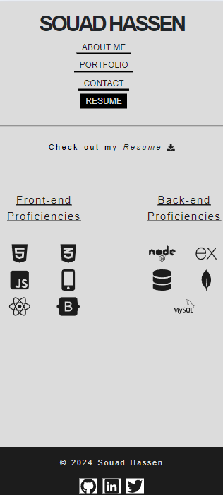

# React Portfolio

## Description

This React Portfolio is designed to showcase my skills and projects as a web developer. The portfolio is a single-page application (SPA) built using React, highlighting key work samples, skills, and experiences.

The primary goal of this project is to provide employers with an easy-to-navigate, responsive platform to assess my skills in web development. The portfolio features a collection of deployed projects, each with live links and corresponding GitHub repositories. The React-based structure ensures smooth, seamless navigation, allowing potential employers to explore my projects and get a comprehensive understanding of my technical capabilities.

By visiting this portfolio, employers can quickly determine whether my experience and projects align with their requirements for open positions, especially those requiring expertise in building modern single-page applications.

## Installation

This application requires you install the following:

- Node.js

Once installed:

- Clone the repository to your local machine
- Open the terminal and ensure you are in the right path
- Run the command **npm i** to download the packages
- Run the command **npm run build** to build the application

## Usage

Once everything is installed, you could either run the application locally on your machine by running the terminal command: **npm start**.

Or, also this application is very user intuitive and already live! visit the deployed application link, navigate through the different pages using the links in the nav-bar, and view desired content.

## Deployment

Visit this [link](https://effulgent-kelpie-6cd898.netlify.app/Resume) to view the app live!

## Screenshots

The below screenshots display how the portfolio was setup, along with every page on the nav-bar:

**Home Page -also the About Me page**:

**Portfolio Page**: it show cases my accomplished projects along with their Github and deployed links

**Contact Page**: a Contact form to be submitted. This form has validation on the name, the email and the messages fields

**Resume page**: This page includes my resume available to be downloaded. Along with my frontend and backend proficiencies

This portfolio is also responsive to be able to run on mobile

**Responsive: Home Page -also the About Me page**

**Responsive: Portfolio page**

**Responsive: Contact page**

**Responsive: Resume page**

## License

This project is licensed under the MIT License. To learn more about this means, click the license button at the top.

## Contributing

N/A

## Tests

There is currently no unit testing written yet for this application.

## Questions

GitHub Profile: https://github.com/souad-hb

If you have any additional questions, feel free to contact me at: souadsalahh@gmail.com
